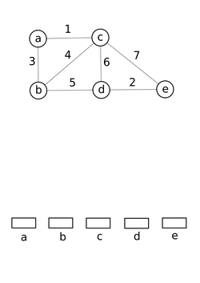

# Disjoint sets
disjoint-set data structure, also called a union–find data structure or merge–find set, is a data structure that keeps track of a set of elements partitioned into a number of disjoint (nonoverlapping) subsets. It supports two useful operations:
* Find: Determine which subset a particular element is in. Find typically returns an item from this set that serves as its "representative"; by comparing the result of two Find operations, one can determine whether two elements are in the same subset.
* Union: Join two subsets into a single subset.

Rank: Keep a track of the depth of each tree to ensure union result has lowest possible depth

# Q.
You are nth in a line of students waiting for viva. There are 3 teachers, who take 3,4 and 7 minutes respectively. Find which teacher you will go to if each student is sent to the available teacher with the lowest time, using binary search